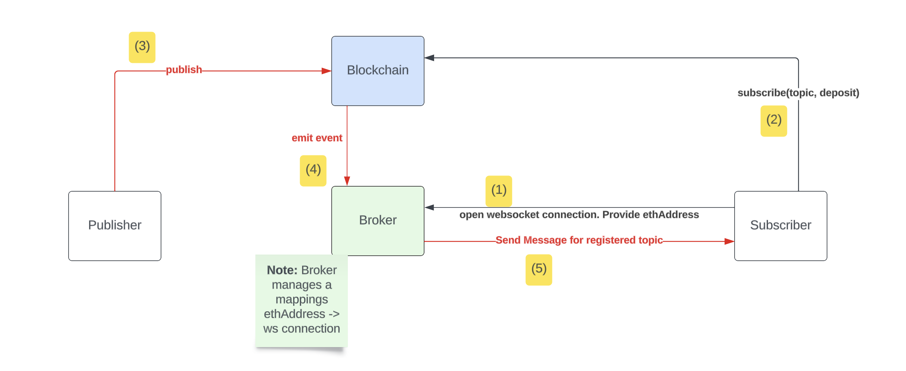

# Publish/Subscribe on the Blockchain
## Demo
https://www.youtube.com/watch?v=Kr6E1B-p4Ok&ab_channel=Pier-OlivierBeaulieu 
## Getting Started
### 1. Create a network on Ganache and start it
```
hostname = 127.0.0.1
Port number = 7545
Network ID = 5777
```

### 2. Install node modules 
```
npm install
```
### 3. Depoyment
- update the `.env` 
- Run deployment (migration)
```
truffle migrate --network ganache --reset
```
### 4. Tests
```
truffle test --network ganache --reset
```

##  Broker 
```
node broker.js {BROKER_PORT}
```
##  Clients (Publishers and Subscribers)
```
node client.js {PRIVATE_KEY} {BROKER_PORT} 
``` 
## Example: 
### Start Broker
```
 node broker.js 65222
```
### Start 3 clients with 3 different Ethereum wallets
``` 
node client.js 83adef4a25423d0bc3ef81ccd38a855dd923f1db978511c54d62c30ab1b8a9be 65222
node client.js b0c9b55816f2ddbe4582253a6ab7fa3987569a350ed68e62f0aeaa93dfa83bc7 65222
node client.js f2466bf4cbb5c03852765c0a31bd2792e6725d5f538bd1d51edbdee47250b2d7 65222


node client.js 21f779cd9811005ecc75d5caf2399628b7f4a19485db8c8e10f148dbc33d3be1 65222
``` 

## System Architecture


### Smart Contract

The Smart Contract is deployed on a blockchain network (e.g., Ethereum) and is responsible for managing the pub-sub functionalities. It stores information about topics, subscribers, and messages. The key components include:

- **Pub-Sub Contract:** The main contract implementing the pub-sub functionalities and business model (Subscribers pay for each received message. )
- **Topics:** Users can advertise and subscribe to different topics, allowing them to receive relevant messages.
- **Subscribers:** Individuals or entities subscribing to specific topics to receive related messages.
- **Messages:** Content published to a topic, which is distributed to all subscribers.

### Broker

The Broker acts as an intermediary between the Smart Contract and WebSocket connections. It enables real-time communication between clients and the blockchain. The Broker's responsibilities include:

- **WebSocket Server:** Listens for incoming WebSocket connections from clients.
- **Connection Management:** Associates WebSocket connections with Ethereum addresses, allowing clients to receive relevant messages.
- **Event Handling:** Listens for events emitted by the Smart Contract, such as message publications, and forwards them to the appropriate WebSocket clients.
- **Client Communication:** Sends and receives messages between WebSocket clients and the Smart Contract.

## Smart Contract Functionalities

### Advertise Topic

Users can advertise new topics on the Smart Contract. This makes the topic available for others to subscribe to.

### Subscribe and Unsubscribe

Clients can subscribe or unsubscribe to specific topics, indicating their interest in receiving messages related to those topics. Subscribers are required to provide a deposit when subscribing to a topic.
- **Deposit Requirement:** Subscribers are required to make a deposit when subscribing to a topic. This deposit serves as a commitment to stay subscribed and actively participate in the pub-sub network.
- **Subscribers pay for each received messsage:** Whenever the smart contract receives a message from a publisher, it deducts 0.005 Ether from the balance of subscribers to the corresponding topic. Subsequently, it generates an event named "MessageReceived" that includes the topic name, the message, and the Ethereum address of the subscriber.
- **Deposit Return:** Deposits are returned to subscribers when they choose to unsubscribe from a topic. This incentivizes responsible participation in the network.

### Publish Message

Authorized users can publish messages to a topic. The Smart Contract ensures that the message is distributed to all subscribers of the relevant topic.


