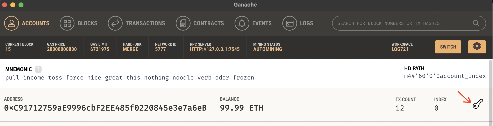

# Publish/Subscribe on the Blockchain
## Getting Started
### Deploy studentNumberContract using Truffle and Ganache
1. Create a network on Ganache and start it
```
hostname = 127.0.0.1
Port number = 7545
Network ID = 5777
```

2. Deploy the Contract
- update the `.env` file to provide the private key of the deployment sender account. This key can be obtained via the Ganache UI. 
- 
- Run deployment (migration) with ` truffle migrate --network ganache`

### Run Tests on Deployed Contract
- Run command `truffle test --network ganache`


## System Architecture
- 